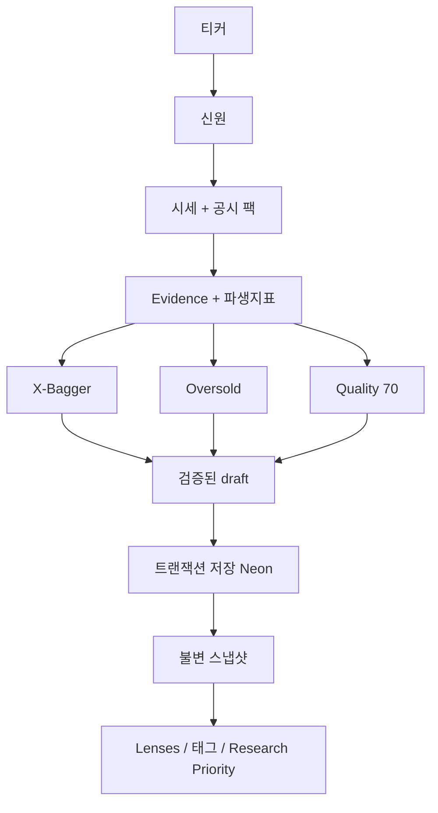

# IDT 투자발견 — 프로젝트 전체 지도

작성: 2026-09-14. 리포 통합: 2026-09-21. 이 파일이 제품·구조·배포·데이터·기준 변경의 한 장 요약이다. 세부 엔진 문서는 아래 [문서 인덱스](#문서-인덱스)로 간다.

점수는 매수/매도 신호가 아니다. 리서치·랭킹 도구다.

---

## 한 줄

**IDT 투자발견 = GitHub `JohnnyHan93/tenbagger-lite` = 예전 Tenbagger / Oversold / Quality70를 합친 하나의 앱.** 세 엔진 점수는 절대 합치지 않는다.

`JohnnyHan93/idt`는 2026-09-17 Grok export 스냅샷이다. 코드 SoT가 아니다. 지도: [`docs/REPO.md`](REPO.md).

| 이름 | 역할 |
|---|---|
| 제품명 | IDT 투자발견 |
| 코드 리포 | [JohnnyHan93/tenbagger-lite](https://github.com/JohnnyHan93/tenbagger-lite) |
| 별칭 리포 | [JohnnyHan93/idt](https://github.com/JohnnyHan93/idt) — 동결, 여기에 엔진 작업 금지 |
| 지금 쓰는 주소 | [https://idt.grok.me](https://idt.grok.me) (Grok 앱 빌더 게시, Neon 연결됨) |
| 예전 주소 | [https://tenbagger-lite.vercel.app](https://tenbagger-lite.vercel.app) — APK 2.4.6이 여기를 염. 서버 DB 없음 |
| 노션/드라이브 | 같은 프로젝트. 리서치 홈 이름은 INV-RESEARCH |
| 사용 방식 | 크롬에서 `idt.grok.me` → 홈 화면에 추가. 전용 APK는 필수가 아님 |

---

## 지금 상태 (2026-09-21)

- 공개(게이트) 주소 `idt.grok.me`에서 분석하면 **Neon에 남는다.**
- 로그인 없음 (`VITE_AUTH_ENABLED=false`). 혼자 쓰는 앱.
- Sample100 Full 100 + 공백 채우기 **완료**. `EXECUTE_FULL_100 = false`.
- 점수 모델: **XBG-v2.3 / OSM-v2.3 / MFC70-v1.4 / CRITERIA-v1**. 과거 스냅샷은 다시 계산하지 않음.
- GitHub `tenbagger-lite`에 push해도 `idt.grok.me`는 **Grok 앱 빌더 Publish**로만 바렌다.
- 기준 JSON 내보내기/적용은 설정 화면.

---

## 세 엔진 (합산 금지)

공유 팩(시세·공시·Evidence·파생지표) → 엔진 세 개가 **각자** 점수.

| 엔진 | 버전 | 질문 | 점수 |
|---|---|---|---|
| X-Bagger (Tenbagger / Wildcard) | XBG-v2.3 | 시총이 실제 경로로 5–10배가 될 수 있는가 | 0–100, 등급 S–F, 하드게이트. F10은 관측 성장 필요 |
| Oversold | OSM-v2.3 | 쌓가, 망가진 것인가 | Opp 0–10 = 0.40F+0.25V+0.10O+0.25R, Value Trap 0–10은 별도 |
| Quality 70 | MFC70-v1.4 | 공시 기준으로 지속 가능한 사업인가 | 0–100, 70 팩터. MFC74는 실험·혼합 금지 |

부가:

- Lenses `LENS-v1.0` — 오버레이. Quality에 더하지 않음
- Research Priority — 리서치 순서일 뿐, 투자 등급 아님
- Cross 화면의 태그는 교집합 표시일 뿐 합성 점수가 아님
- N/A는 0이 아니다. 없는 자료는 커버리지만 깎는다
- 역사 스냅샷은 불변. Refresh/Override는 **새 행을 추가**한다

---

## 데이터 흐름



저장 단위: 회사 + 분석 스냅샷 + evidence (+ 선택 job) 한 트랜잭션.

백엔드:

| 환경 | DB |
|---|---|
| Grok 미리보기 | PGLite (인스턴스 메모리) |
| `idt.grok.me` 게시 | Neon (`deploy.database: true` → `DATABASE_URL` 자동) |
| `tenbagger-lite.vercel.app` | DATABASE_URL 없음 → pglite. 저장이 다음 인스턴스에서 사라짐 |

폰/브라우저 `localStorage` 키 `idt-v21-prefs`는 **캐시·설정**. 운영 원본은 DB.

프로덕션에서 Neon이 없으면 `EPHEMERAL_DB`로 분석 저장을 막는다.

---

## 쓰는 법

1. Discover에서 티커 → ANALYZE. Intel은 `INTC` (INTL 아님).
2. 회사 페이지에서 세 엔진을 나란히 본다.
3. 설정 → **분석 기준 JSON**: 내보내기 → 숫자 수정 → 가져와서 적용. 다음 분석부터. 과거 점수는 안 바렌.
4. 유니버스: CSV / JSON / MD / XLSX, dry-run, lock, export.
5. Backup JSON은 워크스페이스 통짜 백업. 기준 JSON과는 별개다.

크롬 홈화면 (Galaxy): `idt.grok.me` 연 뒤 **⋮ → 홈 화면에 추가**.

---

## 기준을 바꾸는 두 길

### A. JSON (배포 없이)

설정 → 기준 내보내기 (`idt-criteria.json`, schema `idt-criteria-v1`).

넣을 수 있는 것:

- X-Bagger 가중치(합 100), 등급 임계값, 하드게이트, 커버리지 페널티
- Oversold 가중치(합 1), 펀더멘털/밸류/낙폭/리스크/트랩 숫자
- Quality70 등급·커버리지·레드플래그, Q밴드 (`engines.quality70.bands`)

적용하면 `app_kv` settings + 기기 설정에 남고, **다음 ANALYZE**부터 쓠다.

### B. 코드 (게시 필요)

새 팩터, 공식 자체, UI. GitHub `tenbagger-lite`에 올려도, **살아 있는 사이트는 Grok 앱 빌더 Publish**다.

---

## 저장소 구조

```
/workspace
├── src/
│   ├── routes/
│   ├── components/
│   └── lib/engines/  xbagger · oversold · quality · criteria
├── migrations/
├── public/
├── android/          GitHub에만. WebView → idt.grok.me
├── docs/             REPO.md, DEPLOY.md, IDT_REFLECT.md, 이 지도
└── PROJECT_RULES.md
```

화면 경로: `/` 대시보드, `/discover`, `/xbagger`, `/oversold`, `/quality`, `/cross`, `/universe`, `/watchlist`, `/queue`, `/settings`, `/company/$ticker`.

---

## DB 테이블

| 테이블 | 역할 |
|---|---|
| companies | 신원 |
| analyses | insert-only 스냅샷 (jsonb, 모델 버전) |
| evidences | 분석에 묶인 evidence |
| universes / universe_members | 유니버스 |
| analysis_change_logs | 오버라이드 기록 |
| watchlist | 관심 |
| app_kv | settings (기준 팩 포함) |
| research_runs / research_jobs | Full 100 큐 테이블 |

---

## 배포·환경

| 키 | 위치 | 용도 |
|---|---|---|
| `DATABASE_URL` | 서버, 게시 시 플랫폼 주입 | Neon |
| `XAI_API_KEY` | 서버 | 선택 Grok 오버레이 |
| `VITE_AUTH_ENABLED` | `false` | 로그인 없음 |
| `EXECUTE_FULL_100` | 코드 허가 `false` | Full 100 잠금 |
| `IDT_ALLOW_EPHEMERAL` | 예외 플래그 | 프로덕션 pglite 허용. 켜지 말 것 |

비밀은 `VITE_`에 넣지 않는다.

---

## Android (참고만)

패키지 `kr.johnny.idt`. 2.4.6은 `https://tenbagger-lite.vercel.app/`. GitHub 2.4.7은 `https://idt.grok.me/`. **크롬 홈화면을 주 진입점으로 쓠다.**

---

## 하지 말 것

- 세 엔진 점수를 하나의 투자 점수로 합치기
- 없는 시세·재무를 지어내기
- N/A를 0으로 넣기
- 과거 스냅샷을 덮어쓰기
- Full 100 / Locked 59를 임의 실행
- SAMPLE을 실분석처럼 보여주기
- `JohnnyHan93/idt`에 엔진/앱 코드를 새로 올리기

---

## 문서 인덱스

| 파일 | 내용 |
|---|---|
| [REPO.md](REPO.md) | 리포 정본/별칭 |
| [DEPLOY.md](DEPLOY.md) | 게시 |
| [IDT_REFLECT.md](IDT_REFLECT.md) | 투자실 → 앱 에스컬 |
| [PROJECT_RULES.md](../PROJECT_RULES.md) | 불변 규칙 |
| [ARCHITECTURE.md](ARCHITECTURE.md) | 파이프라인 |
| [DATA_MODEL.md](DATA_MODEL.md) | 테이블 |
| [XBAGGER_ENGINE.md](XBAGGER_ENGINE.md) | X-Bagger |
| [OVERSOLD_ENGINE.md](OVERSOLD_ENGINE.md) | Oversold |
| [QUALITY_ENGINE.md](QUALITY_ENGINE.md) | Quality 70 |
| [QUALITY_70_FACTOR_AUDIT.md](QUALITY_70_FACTOR_AUDIT.md) | 70팩터 감사 |
| [EVIDENCE_POLICY.md](EVIDENCE_POLICY.md) | Evidence |
| [INVESTOR_LENSES.md](INVESTOR_LENSES.md) | Lenses |
| [MODEL_GOVERNANCE.md](MODEL_GOVERNANCE.md) | 모델 거버넌스 |
| [MIGRATION.md](MIGRATION.md) | 이전 앱 데이터 |
| [BUILD_STATE.md](BUILD_STATE.md) | 빌드/잠금 상태 |
| [CHANGELOG.md](CHANGELOG.md) | 변경 기록 |

코드 기준 팩: `src/lib/engines/criteria/` (`idt-criteria-v1`, runtime **CRITERIA-v1**).

엔진 버전: XBG-v2.3 · OSM-v2.3 · MFC70-v1.4.

---

## 자주 하는 일

| 하고 싶은 일 | 어디 |
|---|---|
| 가중치·임계값 변경 | 설정 → 기준 JSON, 또는 이 대화에 요청 |
| 새 팩터 / 공식 | `tenbagger-lite` PR → Grok **게시** |
| 사이트에 기능 반영 | Publish (`idt.grok.me`) |
| GitHub 백업 | `JohnnyHan93/tenbagger-lite` (자동 배포 아님) |
| 분석이 안 남음 | `idt.grok.me`인지 확인 |
| 100종목 일괄 | 잠금 (`EXECUTE_FULL_100 = false`) |
